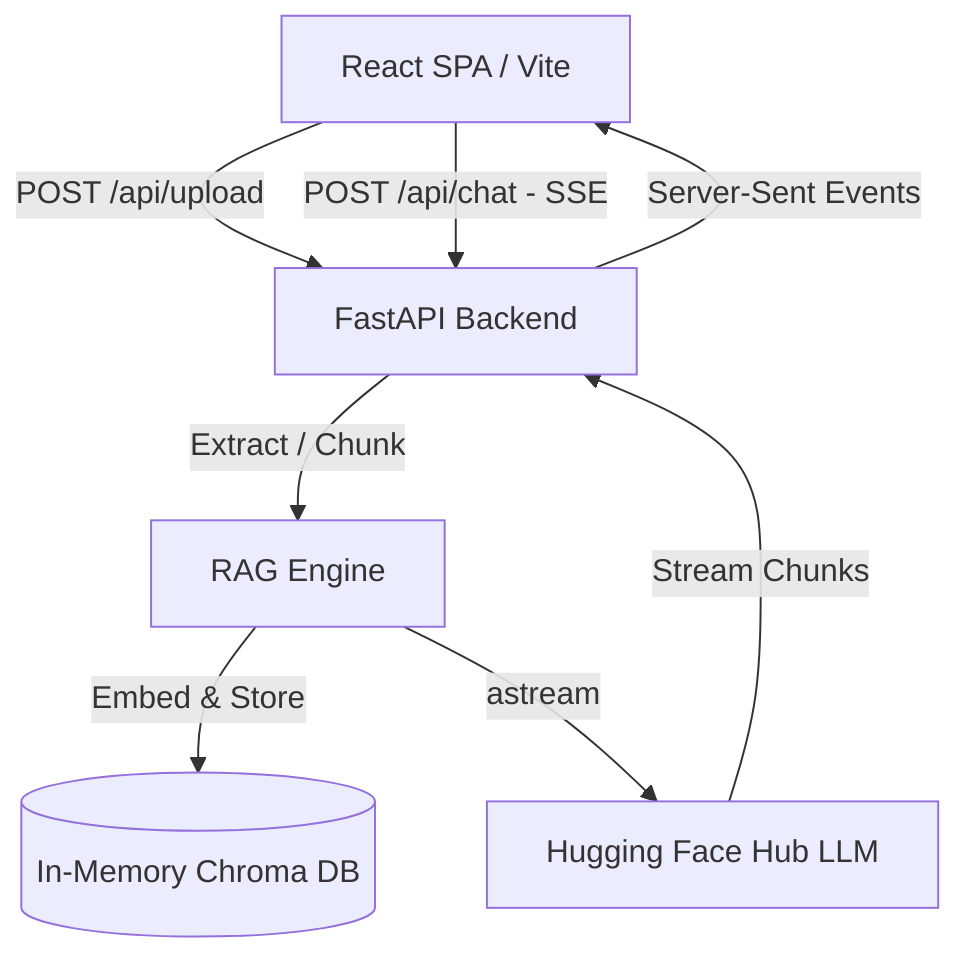

# pdfchat

pdfchat is a decoupled, high-performance RAG chatbot application. It enables zero-overhead PDF ingestion and real-time streaming queries using LangChain and FastAPI.

## Getting Started

### 1. Backend Setup
Navigate to the backend directory, configure the environment, and run the development server:
```bash
cd backend
# Copy .env.example to .env and configure HUGGINGFACEHUB_API_TOKEN
uv run fastapi dev main.py
```

### 2. Frontend Setup
Navigate to the frontend directory, install dependencies, and run the Vite dev server:
```bash
cd frontend
npm install
npm run dev
```

## System Architecture



## Design Decisions & Tradeoffs

| Chose X | Instead of Y | Why |
| :--- | :--- | :--- |
| In-Memory Chroma DB | Managed Vector DB (Pinecone/pgvector) | Eliminates setup overhead. Reduces operational complexity for single-session use cases. |
| Server-Sent Events (SSE) | WebSockets / Polling | Lower protocol overhead. Native browser support with simple unidirectional text streaming. |
| Decoupled Vite + FastAPI | Monolithic Next.js / Python Full-stack | Independent scaling. Enables front-end CDN caching and fast back-end updates. |
| LangChain `astream` | Custom Stream Generator | Simplifies async chain execution. Native support for multi-step LLM output streaming. |

## Technical Highlights

* **Zero-Overhead Memory Footprint**: In-memory stores avoid DB connections.
* **Low Time-To-First-Token (TTFT)**: Async generator yields chunks instantly.
* **Stateless API Design**: Context links to unique session IDs.
* **Atomic File Handling**: Temp files deleted immediately after ingestion.

## Operations & Infrastructure

Data flows securely through unidirectional streams.

```
[PDF Upload] -> [Temp File Disk] -> [Memory Vectorization] -> [Secure Delete]
```

* **Session Isolation**: Unique UUID maps to custom Chroma collections.
* **Strict CORS Rules**: Restricts browser requests to trusted origins.
* **Environment Validation**: Pydantic validates port ranges and API keys.
* **Stream Diagnostics**: Handles sudden network terminations gracefully.

## Future Improvements & Extension Roadmap

Implement the following enhancements in future iterations:

* **Response Refinement**: Introduce an iterative verification or reflection loop (e.g., a secondary LLM chain or post-retrieval validator) to refine response formatting, reduce hallucination, and align output with retrieved references.
* **Persistent Vector DB Storage**: Move from transient in-memory Chroma DB collections to a persistent vector store (like pgvector or a managed directory) to save and retrieve ingested documents across server restarts.
* **Hybrid Search & Re-ranking**: Combine keyword search (BM25) with semantic search (embeddings) and apply a re-ranking model (e.g., Cohere/Cross-Encoder) to select the highest-quality chunks.
* **Multi-Document Sessions**: Upgrade the API and UI to support uploading, indexing, and referencing multiple PDFs concurrently within the same session.
* **User Authentication & Document ACLs**: Secure the ingestion endpoints using JWT authentication to restrict document retrieval to authorized owners.

